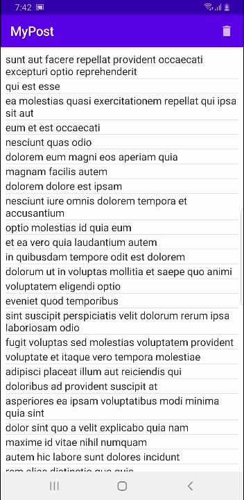
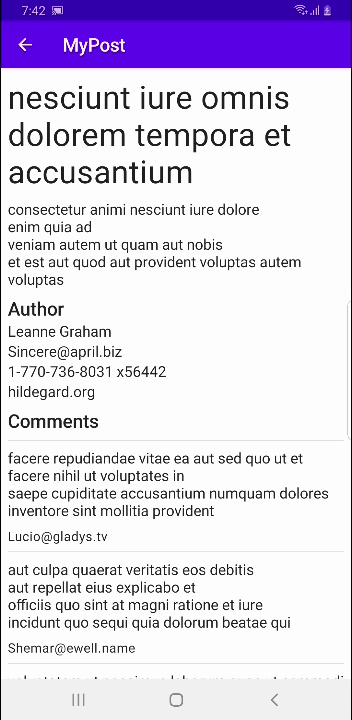

# MyPost App

It's an example app to demonstrate some functionalities
of [jsonplaceholder](https://jsonplaceholder.typicode.com/guide/) like query post, post's author,
and post's comments.

## Views

### Post

It shows all post from [jsonplaceholder](https://jsonplaceholder.typicode.com/guide/) and all posts
are cached in a room database with a policy of one day.



Next actions are available:

* To see the post's detail, you must tap the post row.
* To remove all post, you must tap the button placed on right top corner.
* To remove one post, you must swipe from right to left.
* To refresh data from the REST API service, you must swipe from top to bottom.

### Post's detail

It shows post's details like more content about the post, author, and the post's comments.



Next actions are available:

* To back to the post's list view, you must tap the button placed on left top corner.

## Architecture

The architecture used is well-known as Layered pattern and it has three layers. This architecture
was chosen because it permits to be kept easily.

Source code were made using solid principles and some concepts of clean code. One example of them is
the navigation which is controlled by its own classes and it's easy to expand it or remove it.

Some classes use coroutines and the function to query the post's details is executed in parallel
like this:

```kotlin
class DefaultGetPostDetailUseCase @Inject constructor(
    private val getPostUseCase: GetPostUseCase,
    private val getUserUseCase: GetUserUseCase,
    private val getCommentsUseCase: GetCommentsUseCase
) : GetPostDetailUseCase {

    override suspend fun execute(postId: Int): PostDetail =
        coroutineScope {
            val post = getPostUseCase.execute(postId = postId)
            val authorDeferred =
                async(context = Dispatchers.IO) { getUserUseCase.execute(userId = post.userId.value) }
            val commentsDeferred =
                async(context = Dispatchers.IO) { getCommentsUseCase.execute(postId = post.id.value) }
            return@coroutineScope PostDetail(
                post = post,
                author = authorDeferred.await(),
                comments = commentsDeferred.await()
            )
        }

}
```

The post's author and the post's comments depend of the post, so the query to get author and the
query to get the comments are executed in parallel but after the post is gotten.

### Data

This layer is in charge to query the rest api services. It includes the models for the responses and
the repositories.

### Domain

This layer is in charge to manage the business logic like validations, use cases, and more. The
strong types were used to validate the correct value of the properties but, there are only two
strong types at moment: Identifier, and NonEmptyString. It's planned to have more in the future.

### View

This layer is in charge to manage the views that are displayed to the user. The view were made using
Jetpack Compose and they have their own data models.

## Unit Test

It has some test at moment but there are several unit test is coming up.

## Used SDK

* `com.squareup.retrofit2:retrofit`: It's used to query rest api services.
* `com.google.dagger:hilt-android`: It's used to inject dependencies into classes.
* `androidx.compose.ui:ui`: It's used to display ui views to the user.
* `androidx.hilt:hilt-navigation-compose`: It's used to navigate through views.
* `com.google.accompanist:accompanist-swiperefresh`: It's used to permit swipe refresh gesture.
* `androidx.room:room`: It's used to persist the posts.
* `androidx.datastore:datastore-preferences`: It's used to persist some preferences.

## Coming up

* Functionality to mark a post as favorite